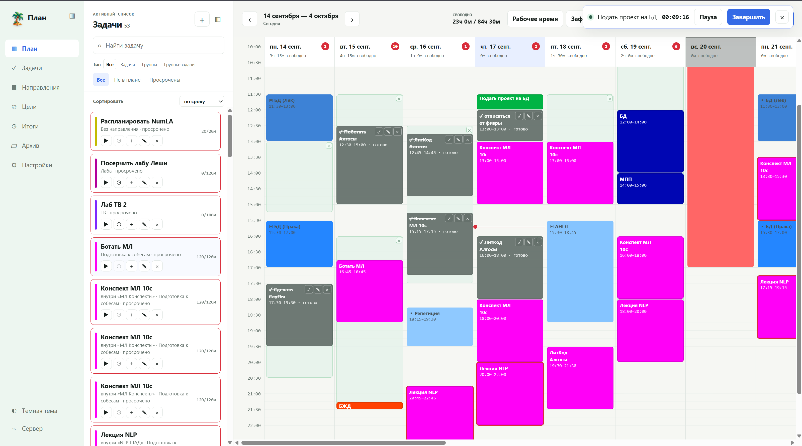

# Планировщик задач и расписания

Личный планировщик задач с недельным календарём, автоматическим распределением
времени, целями, повторяющимися задачами, учётом фактического времени и
отчётами.

Весь текущий проект опубликован в ветке [`MVP`](https://github.com/KolyaNG1/todo-task-sheduler/tree/MVP):

- серверная часть и прикладная логика;
- веб-интерфейс;
- миграции базы данных и тесты;
- техническое задание и документация проекта.

Пользовательская база данных, резервные копии и локальные изменяемые файлы в
репозиторий не входят.
